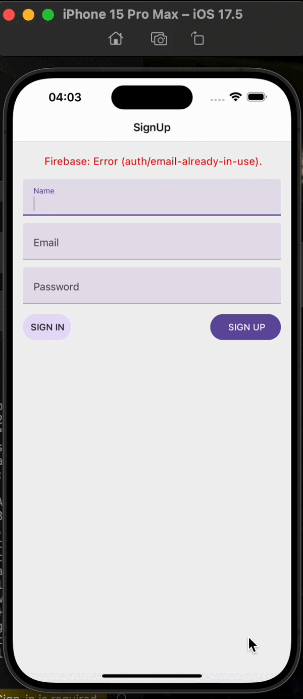

# Chat Application

This project is a simple chat application developed using React Native and Firebase. It allows users to sign up, log in, and chat with other users.

## Features

  •  **User Registration and Login**: Powered by Firebase Authentication.  
  •  **Real-Time Messaging**: Supports Firebase Realtime Database or Firestore for real-time chat functionality.  
  •  **Simple and User-Friendly Interface**: Easy-to-navigate design.  
  •  **Error Handling**: Provides user feedback through error messages (e.g., email-already-in-use error).

## Demo

